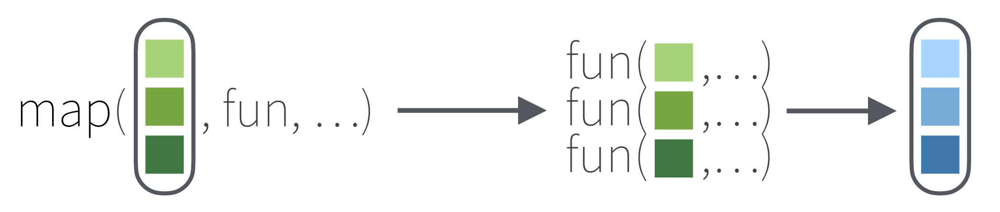
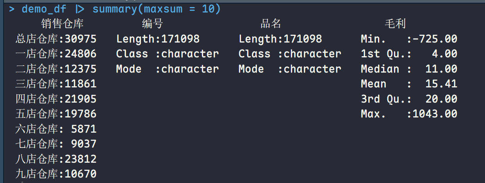
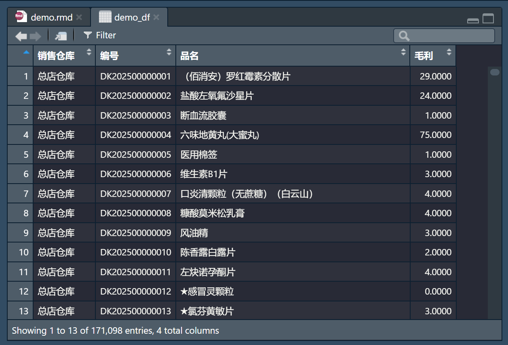
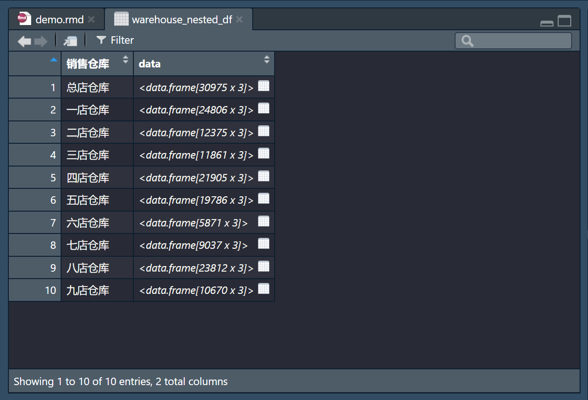
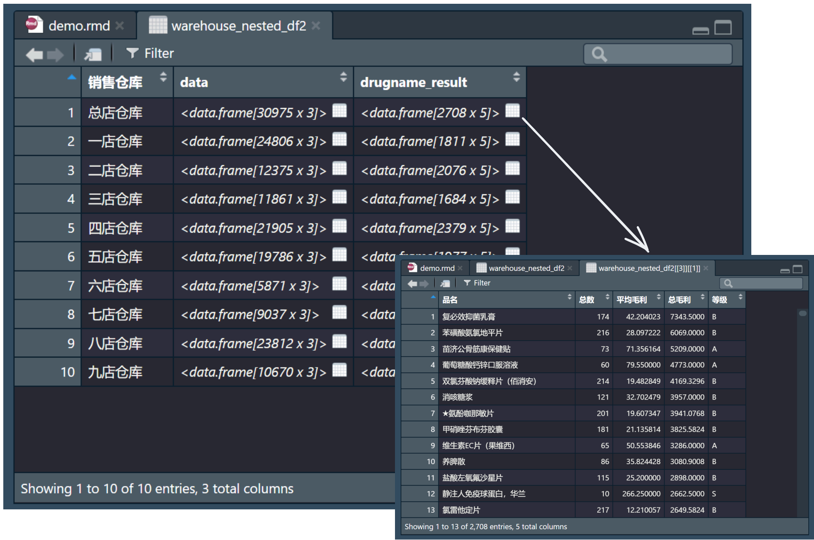
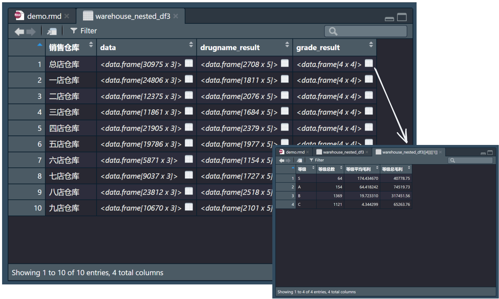
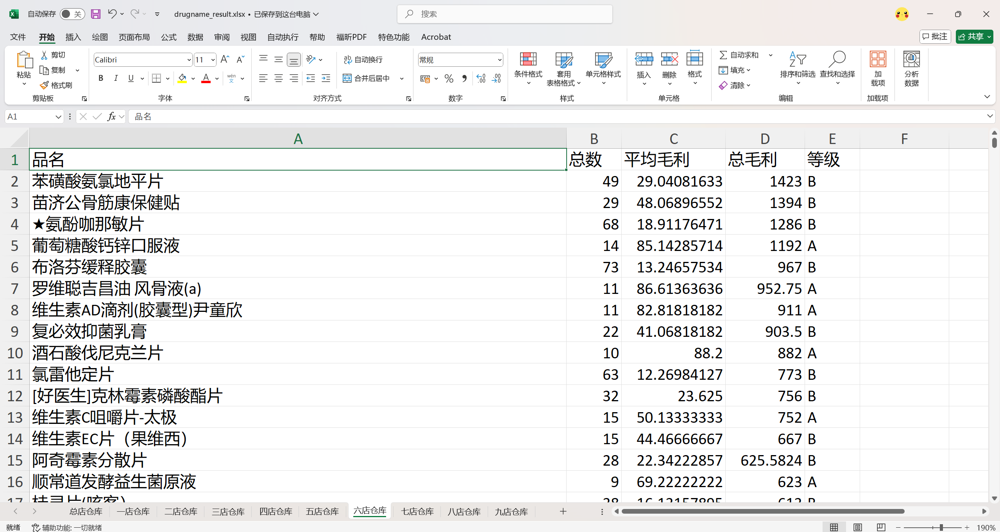

- **扁平数据框（flat data frame）**：传统表格结构，1 行 = 1 条观测记录，1 列 = 1 个变量，难以直接承载多层级数据关系
- **嵌套数据框（nested data frame）**：突破扁平结构限制，通过 “列表列” 将同一分组的数据 “打包” 存储，1 行 = 1 个分组 + 该分组的完整子数据，适配多维度、分层级分析场景



现有一扁平数据框 `demo_df`，包含药品销售记录

```r
demo_df |> summary(maxsum = 10)
```





```r
library(tidyverse)
```

根据`品名`分组，嵌套数据框：

```r
warehouse_nested_df <- demo_df |>
  group_by(销售仓库) |>
  nest() |> 
  # 或者两句合并写为 nest(.by = 销售仓库)
  arrange(销售仓库)
```



定义一个函数：

- 根据`品名`分组汇总`总数平均`、`毛利`和`总毛利`
- 根据`平均毛利`划分`等级`

```r
# 定义函数
summarize_fun <- function(df) {
  df |>
    group_by(品名) |>
    summarize(
      总数 = n(),
      平均毛利 = mean(毛利, na.rm = TRUE),
      总毛利 = sum(毛利, na.rm = TRUE)
      ) |>
    mutate(
      等级 = case_when(
        平均毛利 >= 100 ~ "S",
        平均毛利 >= 50 ~ "A",
        平均毛利 >= 10 ~ "B",
        TRUE ~ "C"
        ),
      等级 = factor(等级, levels = c("S", "A", "B", "C"))
      ) |>
    arrange(desc(总毛利))
  }
```

运用 `mutate()` 配合 `map()`，对 `data` 列的每个 df，逐一应用前面定义的 `summarize_fun()`：

```r
warehouse_nested_df2 <- warehouse_nested_df |>
  mutate(drugname_result = map(data, summarize_fun))
```



再定义一个函数：

- 根据`等级`分组汇总`等级总数`、`等级平均毛利`和`等级总毛利`

```r
# 定义函数2
summarize_fun2 <- function(df) {
  df |>
    group_by(等级) |>
    summarize(
      等级总数 = n(),
      等级平均毛利 = mean(平均毛利, na.rm = TRUE),
      等级总毛利 = sum(总毛利, na.rm = TRUE)
      ) |>
    arrange(等级)
  }
```

运用 `mutate()` 配合 `map()` ，对 `drugname_result` 列的每个 df，逐一应用前面定义的 `summarize_fun2()`：

```r
warehouse_nested_df3 <- warehouse_nested_df2 |>
  mutate(grade_result = map(drugname_result, summarize_fun2))
```



后续可以用 `walk` 函数遍历导出为.xlsx

```r
# 此处用到我封装的函数
> warehouse_nested_df3 |> export_all_nested_to_xlsx(output_dir = "./otpt")
已导出：./otpt/data.xlsx
已导出：./otpt/drugname_result.xlsx
已导出：./otpt/grade_result.xlsx

所有导出完成！目录：D:\RDirectory\pct\otpt
```

效果如下：



附：

```r
export_all_nested_to_xlsx <- function(nested_df, output_dir = ".") {
  # 检查必要包
  required_pkgs <- c("openxlsx", "tidyverse")
  lapply(required_pkgs, function(pkg) {
    if (!requireNamespace(pkg, quietly = TRUE)) {
      stop(paste("请安装包：install.packages('", pkg, "')", sep = ""))
    }
  })
  library(openxlsx)
  library(tidyverse)
  
  # 创建输出目录
  if (!dir.exists(output_dir)) {
    dir.create(output_dir,
               recursive = TRUE,
               showWarnings = FALSE)
    message("已创建输出目录：", output_dir)
  }
  
  # 识别嵌套列
  nested_cols <- names(nested_df)[map_lgl(nested_df, ~ is.list(.) &&
                                            all(map_lgl(., is.data.frame)))]
  if (length(nested_cols) == 0)
    stop("无嵌套数据框列")
  
  # 识别分组列
  group_col <- setdiff(names(nested_df), nested_cols)[1]
  if (is.na(group_col))
    stop("缺少分组列")
  
  # 导出每个嵌套列到Excel
  walk(nested_cols, function(col) {
    wb <- createWorkbook()
    walk(seq_len(nrow(nested_df)), function(i) {
      # 处理工作表名
      sheet_name <- gsub("[\\\\/:*?\"<>|]", "_", nested_df[[group_col]][i])
      sheet_name <- substr(sheet_name, 1, 31)
      
      # 写入数据
      addWorksheet(wb, sheet_name)
      writeData(wb, sheet_name, nested_df[[col]][[i]])
      setColWidths(wb, sheet_name, 1:ncol(nested_df[[col]][[i]]), "auto")
    })
    # 保存文件（无日期）
    saveWorkbook(wb, file.path(output_dir, paste0(col, ".xlsx")), overwrite = TRUE)
    message("已导出：", file.path(output_dir, paste0(col, ".xlsx")))
    rm(wb)
  })
  
  message("\n所有导出完成！目录：", normalizePath(output_dir))
}
```
