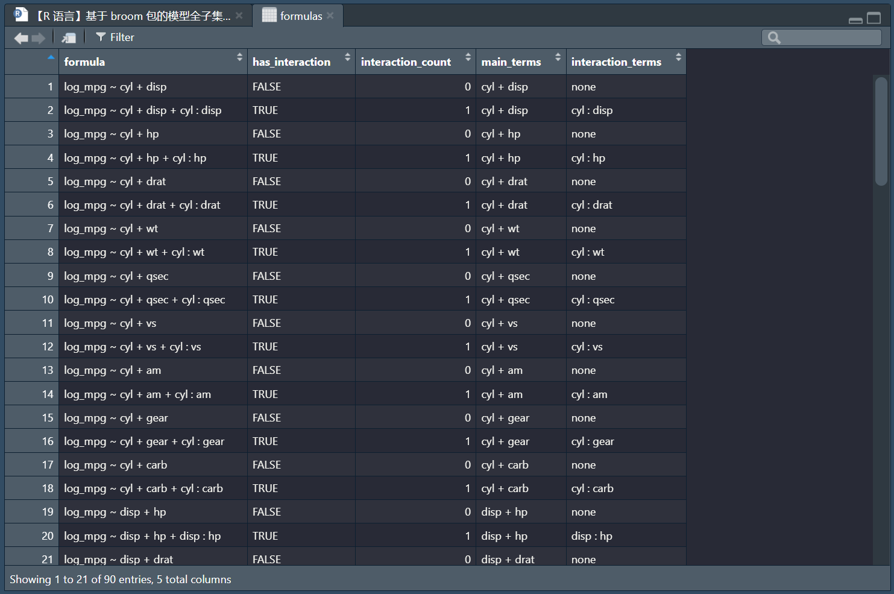
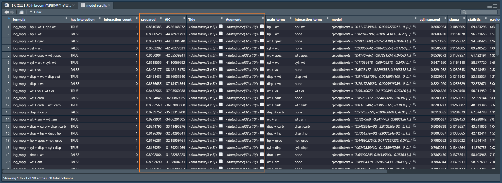

实际不是真的全子集，否则算力要求巨大，并且模型过于复杂且没有可解释性，得不偿失。
所以，我们应当手动设置（本文用的函数）参数 `main_terms_spec`，以控制主效应数量。
# 选定响应变量
预先观察（略），使响应变量符合模型假设，此处作对数变换：
```r
dataset <- mtcars |>
  mutate(log_mpg = log(mpg), .keep = "unused")
```
取响应变量（因变量）为 `log_mpg`：
```r
target <- "log_mpg"
```
# 生成模型的全子集公式
这里用我写的一个函数（置于文末），生成模型的全子集公式（数据框形式）：
```r
formulas <- generate_model_formulas(data = dataset,
                                    target = target,
                                    main_terms_spec = 2) # 主效应数量
                                    # 还可以写1:3、2:4等
# 需注意“模型数量”随“主效应数”和“自变量数”爆炸式增长
```

# 批量建模
`map()` 批量建模并结合 `broom` 稍稍处理：
```r
model_results <- formulas |>
  mutate(
    # 批量建模
    model = map(formula, \(f) possibly(lm, tibble())(as.formula(f), dataset)),
    # 批量总结
	Glance = map(model, glance),
    Tidy = map(model, tidy),
    Augment = map(model, augment)
  ) |>
  unnest(Glance, keep_empty = TRUE) |>
  # 按AIC升序，r方降序
  arrange(AIC, desc(r.squared)) |>
  # 调整列位置
  relocate(formula,
           has_interaction,
           interaction_count,
           r.squared,
           AIC,
           Tidy,
           Augment)
```

**AIC（Akaike Information Criterion，赤池信息准则）**是一个重要的指标，用于衡量模型的复杂度和拟合优良性。AIC的核心思想是寻找既能够良好拟合数据又不过于复杂的模型。$AIC$ 的计算公式为： $$AIC = 2k - 2ln(L)$$其中 $k$ 是模型中参数的数量，$L$ 是模型的似然函数。
**AIC值越小，表示模型越优**。

---
用于生成模型的全子集公式的函数：
```r
generate_model_formulas <- function(data, target, main_terms_spec) {
  # 校验目标变量存在性
  if (!target %in% colnames(data))
    stop("目标变量'target'不在数据集中")
  
  # 校验main_terms_spec类型合法性
  if (!is.numeric(main_terms_spec) &&
      !is.character(main_terms_spec)) {
    stop("'main_terms_spec'必须是数字（向量）或字符向量")
  }
  
  # 提取自变量（排除目标变量）
  all_predictors <- data |> select(-all_of(target)) |> colnames()
  
  # 生成主效应组合
  if (is.numeric(main_terms_spec)) {
    # 处理数字向量（如1:3）
    if (length(main_terms_spec) > 1) {
      return(map_dfr(
        main_terms_spec,
        \(n) generate_model_formulas(data, target, n)
      ))
    }
    # 校验主效应数量范围（允许1）
    if (main_terms_spec < 1 ||
        main_terms_spec > length(all_predictors)) {
      stop("主效应数量需在1至", length(all_predictors), "之间")
    }
    main_combinations <- combn(all_predictors, main_terms_spec, simplify = FALSE)
  } else {
    # 处理字符向量（指定变量，兼容单变量）
    if (!all(main_terms_spec %in% all_predictors)) {
      stop("指定的主效应包含无效变量")
    }
    main_combinations <- list(main_terms_spec)
  }
  
  # 生成模型公式（兼容主效应数量=1的情况）
  map_dfr(main_combinations, \(one_main) {
    main_str <- paste(one_main, collapse = " + ")
    main_count <- length(one_main)  # 新增：获取当前主效应数量
    
    # 仅当主效应数量≥2时，才生成交互项（避免1选2的错误）
    if (main_count >= 2) {
      int_pairs <- combn(one_main, 2, \(p) paste(p, collapse = " : "), simplify = TRUE)
      n_pairs <- length(int_pairs)
      # 生成含0到n_pairs个交互项的组合
      # 只生成双交互项，控制模型复杂度可解释性
      all_ints <- c(list("none"), map(
        1:n_pairs,
        \(k) combn(
          int_pairs,
          k,
          paste,
          collapse = " + ",
          simplify = TRUE
        )
      )) |> unlist()
    } else {
      # 主效应数量=1时，无交互项，仅保留"none"
      all_ints <- "none"
    }
    
    # 统一生成公式数据框
    tibble(
      formula = ifelse(
        all_ints == "none",
        paste(target, "~", main_str),
        paste(target, "~", main_str, "+", all_ints)
      ),
      has_interaction = all_ints != "none",
      interaction_count = ifelse(all_ints == "none", 0, str_count(all_ints, "\\+") + 1),
      main_terms = main_str,
      interaction_terms = all_ints
    )
  }) |> distinct(formula, .keep_all = TRUE)
}
```