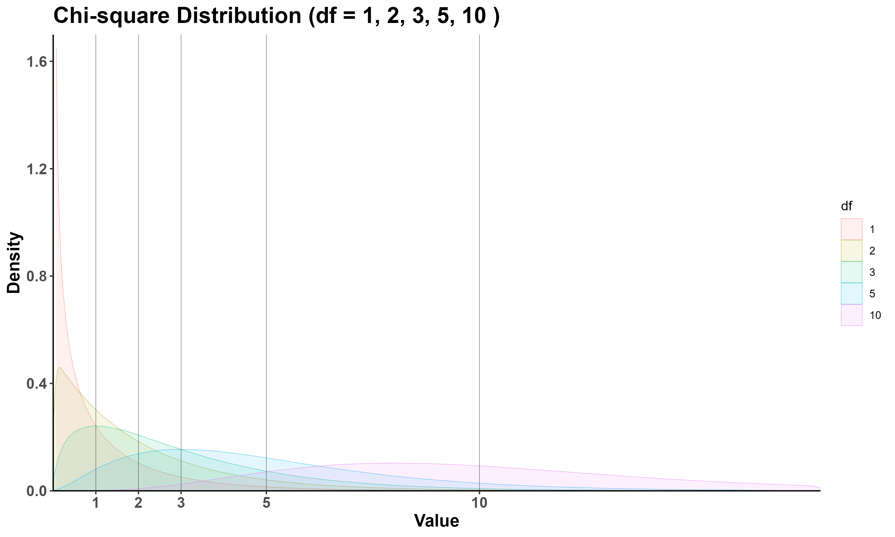
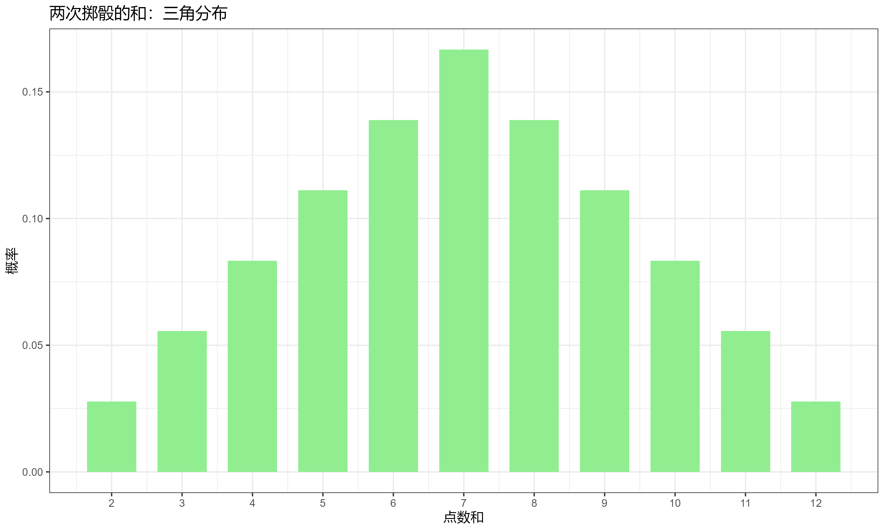
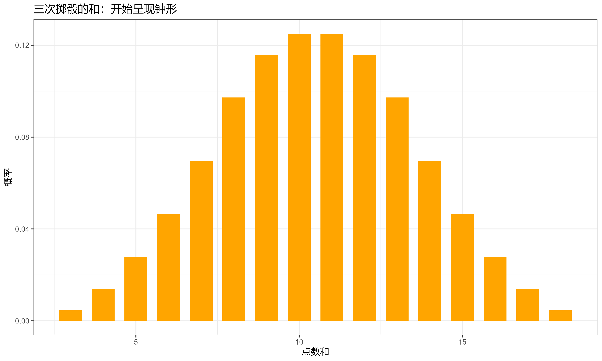
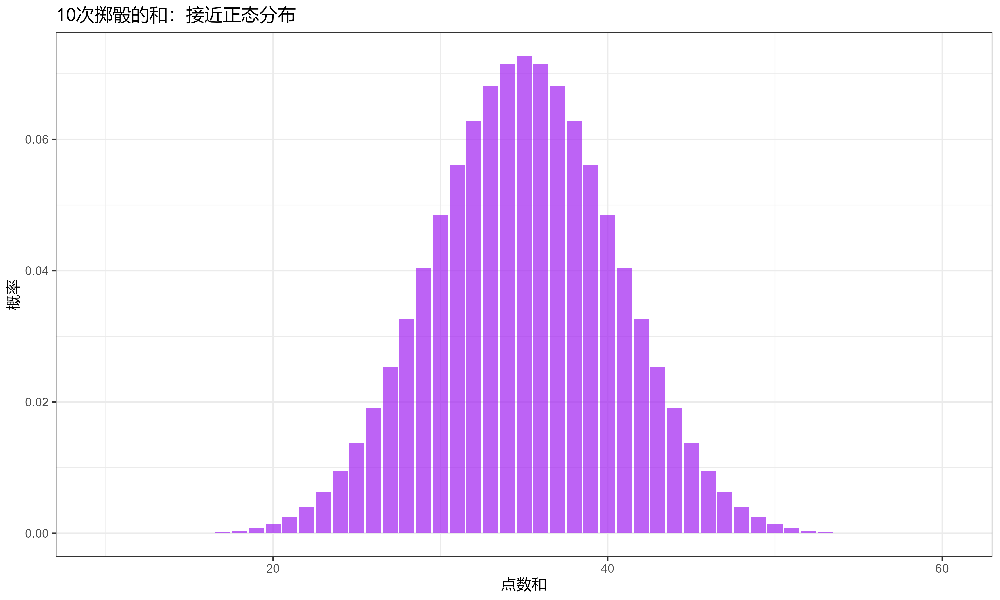
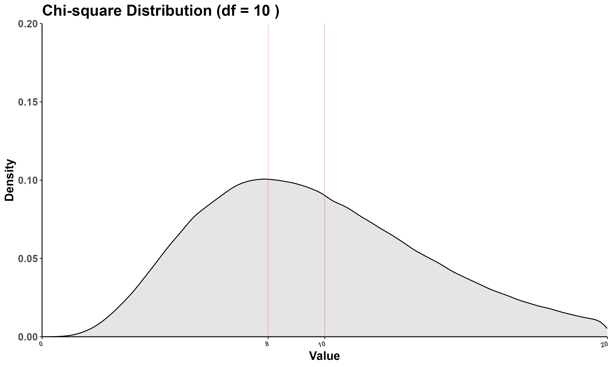
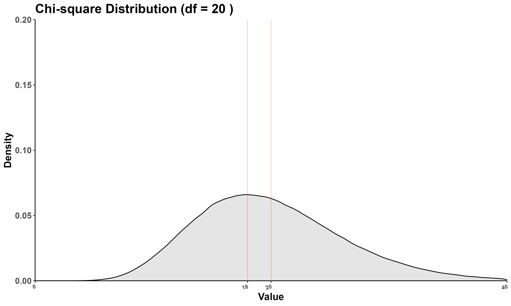
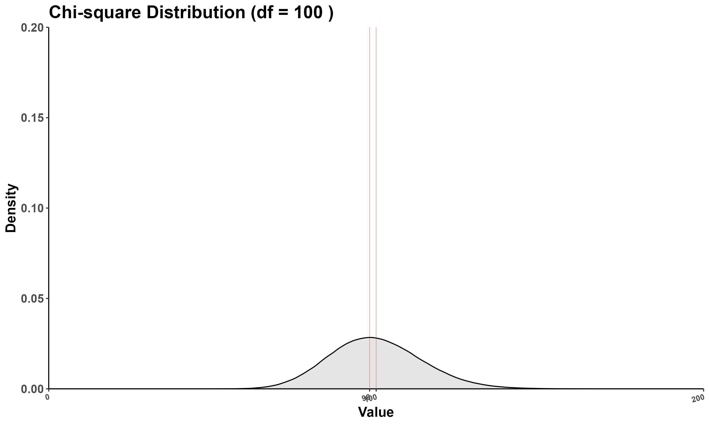

很多人都听过：**卡方分布的自由度越高，越近似于正态分布（中心极限定理）**
不过，到底为啥？卡方分布到底是个啥？

# 基础定义

卡方分布（Chi-square distribution），

- **定义**：如果有 $k$ 个**独立的、服从标准正态分布**的随机变量（$Z_1, Z_2, ..., Z_k$），那么这些变量的**平方和**就服从一个自由度为 $k$（$df=k$）的卡方分布。用公式写就是：  

$$X = {Z_1}^2 + {Z_2}^2 + ... + {Z_k}^2$$

这里的 $X$ 就服从卡方分布（$X \sim \chi^2(k)$），$k$ 就是它的自由度。

卡方分布每一项都是平方，所以都大于0

# 初步观察

这张图屡见不鲜：
（模拟一百万个数据点）


$df=1$ 时很好理解，完全就是标准正态分布 $N(0,1)$ 取平方，自然是0附近密度最大。

$df=2$ 时，$X = {Z_1}^2 + {Z_2}^2$ 有两个标准正态分布的平方和，**注意两个是独立的！** 密度最大的地方还是0附近。

$df=3$ 时，$X = {Z_1}^2 + {Z_2}^2 + {Z_3}^2$ 有三个标准正态分布的平方和，要让 $X^2=0$，三项都必须等于0，由于**卷积的平滑效应**，这个概率变小了，这时候已经有些明显。

以此类推，**随着 $df$ 变大，项越来越多，卷积的平滑效应越来越明显。**

我们可以这样理解卷积的平滑效应：当自由度大于2时，要使得平方和接近0，必须要求所有的标准正态变量**同时**接近0。虽然每个变量接近0的概率都不低，但是多个变量同时接近0的概率就会随着变量个数增加而降低。而且，随着自由度增加，平方和取小值的概率会越来越小，因为只要有一个变量不接近0，平方和就会变大。

有一个很简单理解的例子可以帮助理解卷积的平滑效应：

# 投掷骰子（插入）

卷积就是计算“所有可能的组合方式”的数学操作，它在概率论中用于计算两个独立随机变量之和的分布。

便于理解，投掷骰子这个例子是**离散卷积**。

- 单次掷骰：均匀分布（1-6 点，各 $\frac{1}{6}$ 概率） 
- 两次掷骰的和：三角分布（7 点的概率最高）：
	- 两次掷骰的和为2（极端值）：需要两次都是1，概率为 $(\frac{1}{6})^2$
	- 两次掷骰的和为12（极端值）：需要两次都是6，概率也为 $(\frac{1}{6})^2$
	- 两次掷骰的和为7（中间值）：能实现的组合却是十分之多，(1,6)、(2,5)、(3,4)、(4,3)、(5,2)、(6,1) 六种方式都可以

- 三次掷骰的和：开始呈现钟形 

- 多次掷骰的和：接近正态分布


**这就是卷积的平滑效应：中间值有更多的组合方式，所以概率更高！**

# 直接可视化

而卡方分布是连续卷积。

继续直观地看。

**随着 $df$ 变大，项越来越多，卷积的平滑效应越来越明显。**


$df$ 小的时候右偏态分布，随着 $df$ 变大越来越像正态分布，而且注意看峰对应$x$轴的值，从左往右逐渐地接近 $df$（红线处）

# 数学推导

峰对应$x$轴的值是多少？与 $df$ 是什么关系？为什么是 $df>2$ 时？

## 1. 卡方分布的概率密度函数

**自由度为 $k$ 的卡方分布的概率密度函数（PDF）为：**

$$
f(x;k) = \frac{1}{2^{\frac{k}{2}} \Gamma\left(\frac{k}{2}\right)}\cdot x^{\frac{k}{2}-1}\cdot e^{-\frac{x}{2}}, \quad x > 0
$$

## 2. 取对数简化求导

$$
\ln f(x;k) = \ln\left[\frac{1}{2^{\frac{k}{2}} \Gamma\left( \frac{k}{2} \right)} \right] + \ln x^{\frac{k}{2} - 1}  + \ln e^{-\frac{x}{2}} 
$$

$$
\ln f(x;k) = C + \left(\frac{k}{2} - 1\right) \ln x - \frac{x}{2}
$$

其中 $C = \ln\left[\frac{1}{2^{\frac{k}{2}} \Gamma\left( \frac{k}{2} \right)} \right]$ 为常数。

## 3. 对 $x$ 求导并令导数为零

$$
\frac{d}{dx} [\ln f(x;k)] = \frac{\frac{k}{2} - 1}{x} - \frac{1}{2}
$$

令导数为零：
$$
\frac{\frac{k}{2} - 1}{x} - \frac{1}{2} = 0
$$

$$
x = k - 2
$$

验证最大值点，求二阶导数：

$$
\frac{d^2}{dx^2} [\ln f(x;k)] = -\frac{\frac{k}{2} - 1}{x^2}
$$

当 $k > 2$ 时，二阶导数为负，确认 $x = k - 2$ 是最大值点。

## 4. 函数行为分解法

回到原来的PDF，可以推出**PDF 正比式：**

$$
f(x;k) \propto x^{\frac{k}{2}-1} \cdot e^{-\frac{x}{2}}, \quad x > 0
$$

| 自由度   | PDF 正比式 (x > 0)                    | 关键特征                                      | 众数 |
| -------- | ------------------------------------- | --------------------------------------------- | ---- |
| **df=1** | $$ x^{-0.5} \cdot e^{-\frac{x}{2}} $$ | x=0 处奇点（趋于无穷大）                      | 0    |
| **df=2** | $$ e^{-\frac{x}{2}} $$                | x=0 处最大值，退化为纯指数函数                | 0    |
| **df=3** | $$ x^{0.5} \cdot e^{-\frac{x}{2}} $$  | **指数首次为正！**多项式项在x小时主导（增长） | 1    |
| **df=4** | $$ x^{1} \cdot e^{-\frac{x}{2}} $$    | 多项式项在x小时主导（增长）                   | 2    |

由于 $e^{-\frac{x}{2}}$ 指数级的特征，所以x足够大时总会占主导位置（保证了右侧永远在衰减），并且与多项式项共同作用产生众数

## 5. 结论

对于 $k > 2$，卡方分布的众数（其密度图的峰对应x轴的值）为 $k - 2$；$0 < k \leq 2$ 时，众数为0。具体分段表示为：

$$
\text{Mode}(k) = 
\begin{cases} 
0, & 0 < k \leq 2 \\
k - 2, & k > 2 
\end{cases}
$$

**随着 $df$（即 $k$）变大，众数越接近 $df$：**





$df$（即式子里的 $k$） 越大越接近，是因为足够大时，可以认为 $k-2=k$，而间隔始终是2！
别忘了！$k-2$ 是峰对应$x$轴的值，$k$ 是 $df$。

# 最终

- **卡方分布是，独立标准正态分布随机变量，的平方，经过卷积（求和）后形成的分布，其形态演变完美体现了卷积的平滑效应**
- **卷积的平滑效应：中间值有更多的组合方式，所以概率更高！**

---
# CODE 实践
## 不同自由度的卡方分布绘制在同一张图
```r
library(tidyverse)

# 设置参数
n <- 10000000  # 模拟次数
df_values <- c(1, 2, 3, 5, 10)  # 展示的自由度

# 第一步：生成各标准正态分布的平方值（中间数据）
intermediate_data <- map_dfr(df_values, \(k) {
  # 生成k列标准正态分布随机数
  norm_matrix <- matrix(rnorm(n * k), ncol = k)
  # 计算每个值的平方
  square_matrix <- norm_matrix^2
  # 转换为数据框并添加自由度标识
  as_tibble(square_matrix) |>
    set_names(paste0("z", 1:k, "_square")) |>
    mutate(df = k) |>
    relocate(df)
})


# 第二步：基于中间数据计算卡方值（平方和）
data <- intermediate_data |>
  # 按自由度分组，对每组的平方值列求和（忽略NA，因为不同自由度列数不同）
  group_by(df) |>
  mutate(
    value = rowSums(across(starts_with("z")), na.rm = TRUE)  # 对所有z*_square列求和
  ) |>
  ungroup() |>
  # 保留卡方值和自由度列
  select(value, df) |>
  mutate(df = factor(df))


# 绘制密度图
ggplot(data, aes(x = value)) +
  geom_density(aes(color = df, fill = df),
               linewidth = 0.1,
               alpha = 0.1) +
  # 为每个自由度添加竖线（x = 自由度值）
  geom_vline(
    xintercept = df_values,
    # 所有自由度值作为竖线位置
    color = "black",
    # 竖线颜色
    linewidth = 0.1,
    # 线条宽度
  ) +
  theme_classic() +
  scale_x_continuous(
    limits = c(0, 18),
    expand = c(0, 0),
    breaks = df_values  # 只显示自由度对应的刻度
  ) +
  scale_y_continuous(limits = c(0, 1.7), expand = c(0, 0)) +
  labs(
    title = paste(
      "Chi-square Distribution (df =",
      paste(df_values, collapse = ", "),
      ")"
    ),
    x = "Value",
    y = "Density"
  ) +
  theme(
    plot.title = element_text(size = 18, face = "bold"),
    # 增大并加粗标题
    axis.title.x = element_text(size = 14, face = "bold"),
    # 增大并加粗x轴标签
    axis.title.y = element_text(size = 14, face = "bold"),
    # 增大并加粗y轴标签
    axis.text.x = element_text(size = 12, face = "bold"),
    # 增大并加粗x轴刻度
    axis.text.y = element_text(size = 12, face = "bold")
    # 增大并加粗y轴刻度
  )
```
## 逼近正态分布的批量可视化
```r
library(tidyverse)

# 设置参数
n <- 1000000  # 模拟次数
df_values <- seq(20, 300, by = 20)  # 自由度序列（20到300，间隔20）
save_dir <- "D:\\ObsidianDirectory\\R\\新建文件夹\\plots"  # 保存路径

# 创建保存目录（若不存在）
if (!dir.exists(save_dir)) {
  dir.create(save_dir, recursive = TRUE)
}

set.seed(42)  # 固定随机种子，保证结果可复现

# 批量生成并保存图像
walk(df_values, function(k) {
  k <- as.numeric(k)  # 确保k为数值型
  
  # 直接生成卡方分布数据
  chi2_data <- tibble(
    value = rchisq(n, df = k),
    # 直接使用rchisq函数生成数据
    df = factor(k)
  )
  
  # 绘制密度图（固定y轴范围）
  p <- ggplot(chi2_data, aes(x = value)) +
    geom_density(fill = 'black',
                 linewidth = 0.5,
                 alpha = 0.1) +
    theme_classic() +
    scale_x_continuous(
      limits = c(0, 2 * k),
      # x轴范围为0到2df
      expand = c(0, 0),
      breaks = c(0, k, 2 * k)
      # 显示刻度
    ) +
    scale_y_continuous(
      limits = c(0, 0.1),
      # 固定y轴范围
      expand = c(0, 0)
    ) +
    # 添加对应自由度的竖线（x = k处）
    geom_vline(
      xintercept = k,
      # 竖线位置为当前自由度
      color = "red",
      # 竖线颜色
      linewidth = 0.1   # 线条宽度
    ) +
    labs(
      title = paste("Chi-square Distribution (df =", k, ")"),
      x = "Value",
      y = "Density"
    ) +
    theme(
      plot.title = element_text(size = 18, face = "bold"),
      # 增大并加粗标题
      axis.title.x = element_text(size = 14, face = "bold"),
      # 增大并加粗x轴标签
      axis.title.y = element_text(size = 14, face = "bold"),
      # 增大并加粗y轴标签
      axis.text.x = element_text(
        size = 12,
        face = "bold",
        angle = 15,
        hjust = 1
      ),
      # 增大并加粗x轴刻度
      axis.text.y = element_text(size = 12, face = "bold")   # 增大并加粗y轴刻度
    )
  
  # 保存图像
  ggsave(
    filename = paste0("chi2_df_", k, ".png"),
    plot = p,
    path = save_dir,
    width = 10,
    height = 6,
    dpi = 300
  )
  
  cat("已保存自由度为", k, "的图像\n")
})

cat("所有图像已保存至：", save_dir, "\n")
```
## 投掷骰子
```r
library(tidyverse)

# 计算两次掷骰的和的分布
two_dice <- expand.grid(die1 = 1:6, die2 = 1:6) %>%
  mutate(sum = die1 + die2) %>%
  count(sum) %>%
  mutate(prob = n / 36)

ggplot(two_dice, aes(x = sum, y = prob)) +
  geom_col(fill = "lightgreen", width = 0.7) +
  scale_x_continuous(breaks = 2:12) +
  labs(title = "两次掷骰的和：三角分布", 
       x = "点数和", y = "概率") +
  theme_bw()

# 计算三次掷骰的和的分布
three_dice <- expand.grid(die1 = 1:6, die2 = 1:6, die3 = 1:6) %>%
  mutate(sum = die1 + die2 + die3) %>%
  count(sum) %>%
  mutate(prob = n / 216)  # 6^3 = 216

ggplot(three_dice, aes(x = sum, y = prob)) +
  geom_col(fill = "orange", width = 0.7) +
  labs(title = "三次掷骰的和：开始呈现钟形", 
       x = "点数和", y = "概率") +
  theme_bw()

# 模拟10次掷骰的和（通过卷积计算）
convolution_pmf <- function(pmf, n) {
  result <- pmf
  for(i in 2:n) {
    result <- convolve(result, rev(pmf), type = "open")
  }
  result[1:(length(pmf) + (n-1)*(length(pmf)-1))]
}

pmf <- rep(1/6, 6)  # 单次掷骰的PMF
n_rolls <- 10
ten_dice <- convolution_pmf(pmf, n_rolls)

ten_dice_df <- tibble(
  sum = n_rolls:(n_rolls + length(ten_dice) - 1),
  prob = ten_dice
)

ggplot(ten_dice_df, aes(x = sum, y = prob)) +
  geom_col(fill = "purple", alpha = 0.7) +
  labs(title = "10次掷骰的和：接近正态分布", 
       x = "点数和", y = "概率") +
  theme_bw()
)
```
---

参考：

[【人话统计学概念】一次搞懂卡方检验三大类型：独立性检验、同质性检验、拟合优度检验！_哔哩哔哩_bilibili](https://www.bilibili.com/video/BV15tHQzrECH/?spm_id_from=333.1391.0.0&vd_source=44a0954fac8bbe48022f43ab92c0ddba)

[深入浅出详解卡方分布：直观理解、案例求解及可视化分析 - 知乎](https://zhuanlan.zhihu.com/p/682218728)

[卡方分布的概率密度函数和它的一些衍生问题 - 知乎](https://zhuanlan.zhihu.com/p/268756365)