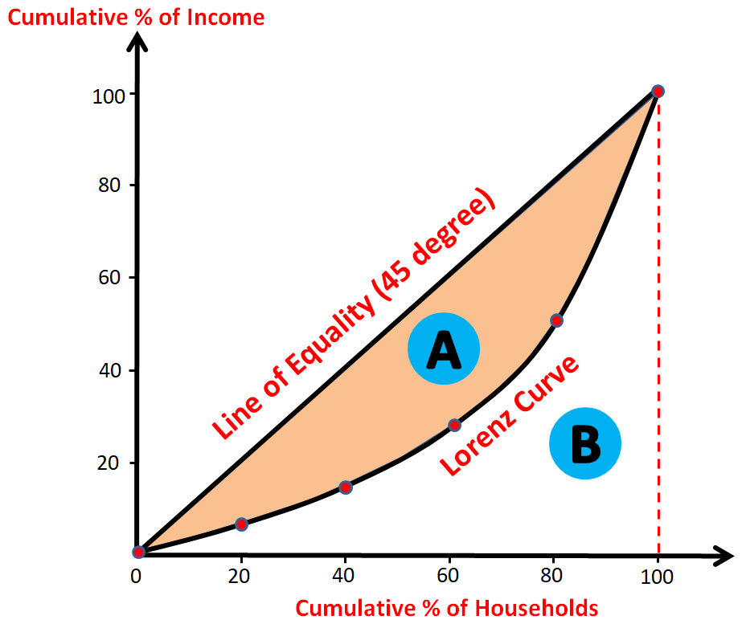
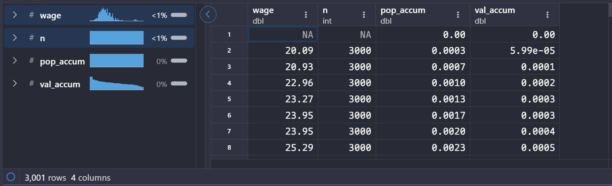
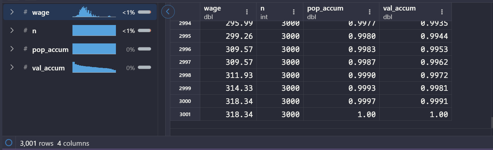
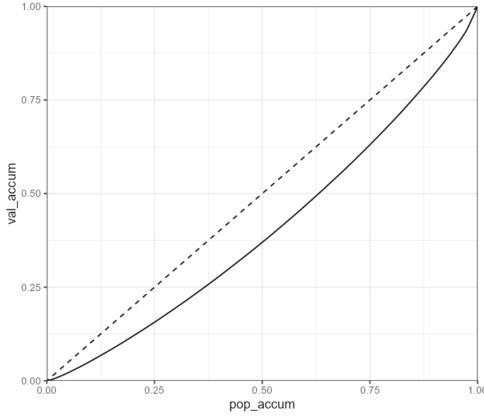
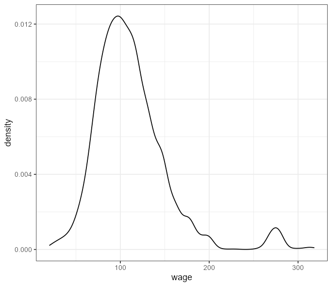

**洛伦兹曲线（Lorenz Curve）** 和 **基尼指数（Gini Index）**是衡量不平等程度的重要工具。其广泛应用于宏观经济、医疗、教育等领域。


# 概念

洛伦兹曲线用于**可视化不平等**；基尼指数用于**量化不平等**。

1. 洛伦兹曲线

- **横轴**：资源占有量从低到高排序的 “人口累计百分比”
- **纵轴**：对应横轴人口所拥有的 “资源累计百分比”
**曲线越下弯曲，越不平等**
1. 基尼指数
以洛伦兹曲线为基础：

- $S_{A}$：洛伦兹曲线与 “绝对平等线” （下三角斜边）之间的面积
- $S_{B}$：洛伦兹曲线与 “绝对不平等线”（下三角两条直角边）之间的面积

$$
Gini = \frac{S_{A}}{S_{A} + S_{B}}
$$
其取值范围：$[0, 1]$
**值越大，越不平等**

# 加载包和数据

`ISLR`内置的`Wage`数据集：
Wage and other data for a group of 3000 male workers in the Mid-Atlantic region.

```r
library(tidyverse)
Wage_df <- ISLR::Wage
```

接下来探究这3000人的`wage`分配是否平等。

# 一、洛伦兹曲线

## 数据预处理

计算累积人口比例和累积`wage`比例，这是绘制洛伦兹曲线的基础数据。

```r
data <- Wage_df |> 
  select(wage) |> 
  arrange(wage) |> 
  mutate(
    n = n(),
    pop_accum = row_number() / n,
    val_accum = cumsum(wage) / sum(wage)
  ) |> 
  add_row(pop_accum = 0, val_accum = 0, .before = 1)
```




## 绘制洛伦兹曲线

```r
ggplot(data, aes(x = pop_accum, y = val_accum)) +
  geom_line() +
  geom_abline(intercept = 0, slope = 1, linetype = "dashed") +
  coord_cartesian(xlim = c(0, 1), ylim = c(0, 1), expand = FALSE) +
  theme_bw()
```


洛伦兹曲线展示了`wage`分配情况，其中对角线表示绝对平等的分配，曲线越下弯曲（靠近“绝对不平等线”）表示分配越不平等。

# 二、基尼指数

## 计算洛伦兹曲线下面积

通过**梯形法则**计算洛伦兹曲线下的面积`area_under_Lorenz`（$S_{B}$），这是计算基尼指数的关键步骤。

```r
area_under_Lorenz <- data |> 
  mutate(
    x_diff = pop_accum - lag(pop_accum),
    y_mean = (val_accum + lag(val_accum)) / 2
  ) |> 
  summarise(area_under_Lorenz = sum(x_diff * y_mean, na.rm = TRUE)) |> 
  pull(area_under_Lorenz)
```

```r
> area_under_Lorenz # 结果
[1] 0.4045936
```

## 计算基尼指数

$$
S_{B} = 0.4045936
$$
$$
S_{A} + S_{B} = 0.5
$$
$$
Gini = \frac{S_{A}}{S_{A} + S_{B}}
$$

```r
Gini_Index = (0.5 - area_under_Lorenz) / 0.5
```

```r
> Gini_Index # 结果
[1] 0.1908127
```

基尼指数`Gini_Index`用于量化`wage`的不平等程度，值为0表示完全平等，值为1表示完全不平等。
0.191的基尼指数说明工资分配较为平等

---
附：
`wage`的分布

```r
ggplot(data, aes(wage)) +
  geom_density() +
  theme_bw()
```


