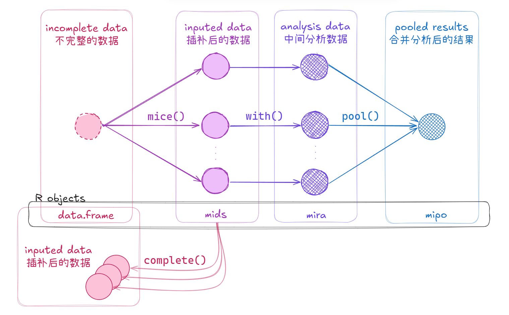
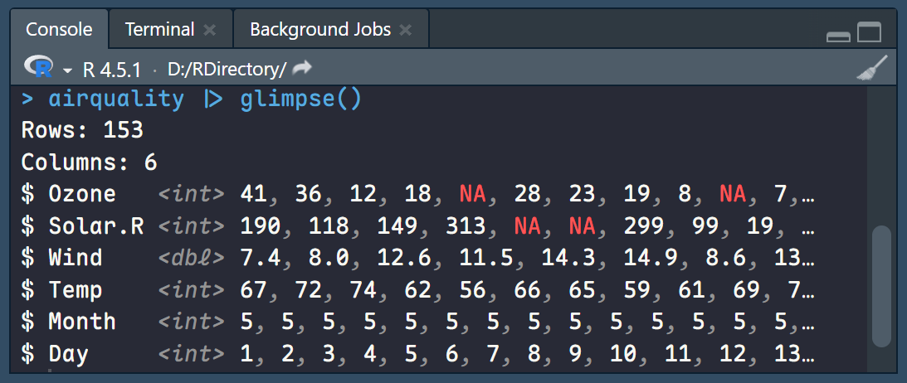
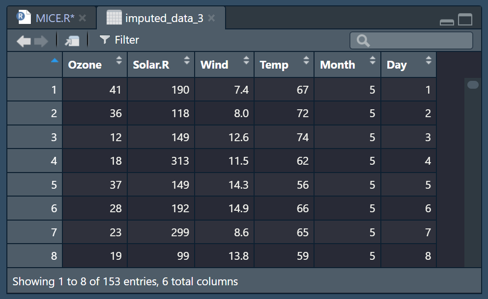
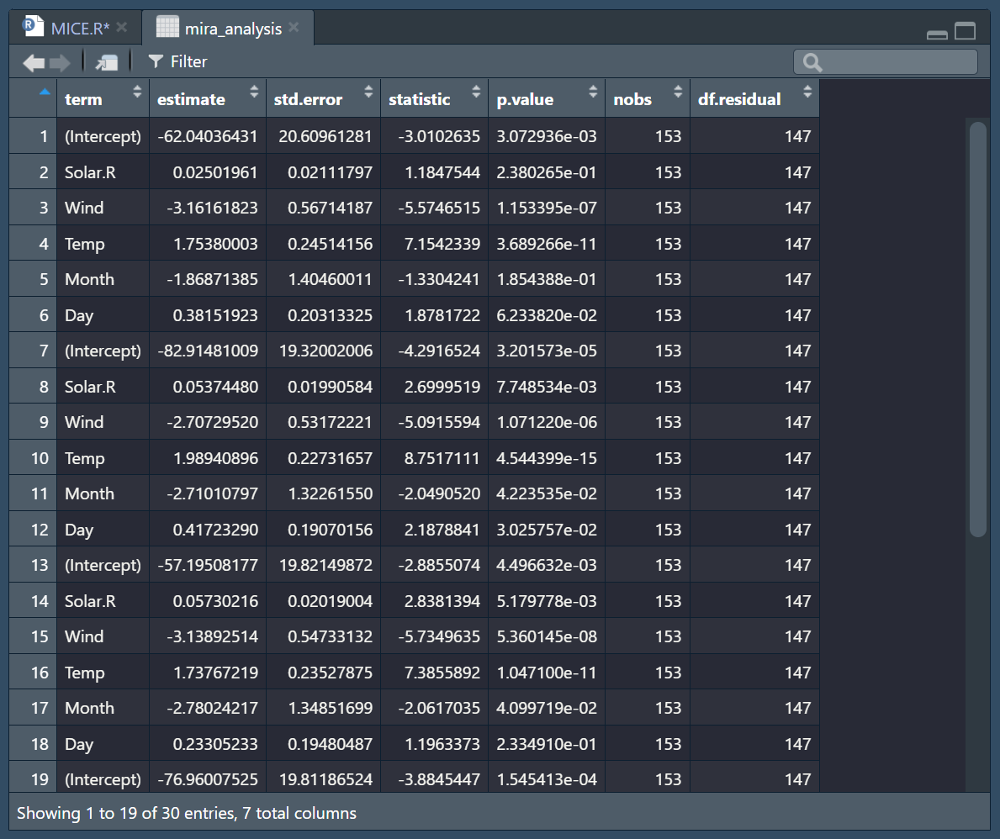
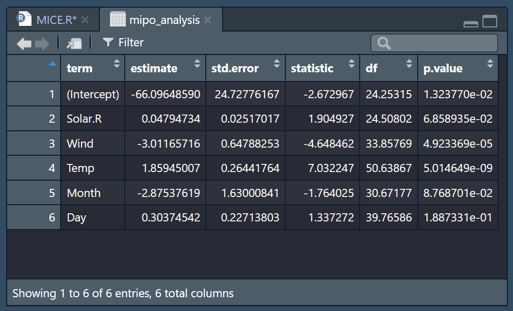
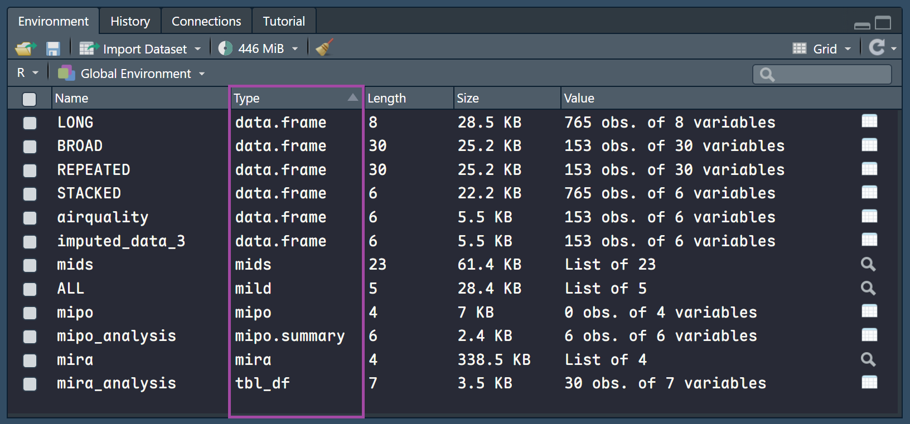

**插补缺失数据 -> 多套数据分别建模 → 合并模型结果**

```r
library(tidyverse)
library(mice)
```

# 1. 数据与缺失值查看
```r
data(airquality)
# 内置空气质量数据集

airquality |> glimpse()
# 预览 airquality 的数据结构

airquality |> map_int(\(c) sum(is.na(c)))
# 查看每列缺失值
```




# 2. mice() 多重插补
```r
set.seed(123)

mids <- airquality |> 
  mice(m = 5, method = "pmm")
# 预测均值匹配，5 重插补
```

# 3. complete() 提取插补后的 data.frame
```r
imputed_data_3 <- mids |> 
  complete(3)
# 提取第三套 data.frame

imputed_data_3 |> map_int(\(c) sum(is.na(c)))
# 验证每列缺失值
```




# 4. with() 批量建模
```r
mira <- mids |> 
  with(lm(Ozone ~ Solar.R + Wind + Temp + Month + Day))
# 批量拟合相同线性回归模型

mira_analysis <- mira |> summary()
# 可以得到 5 个模型的汇总结果
```



# 5. pool() 合并分析结果
```r
mipo <- mira |>
  pool()
# 基于统计理论，一键合并分析得到最终结果

mipo_analysis <- mipo |> summary()
# 得到合并模型的最终汇总结果
```



从表格中可以得到最终的线性回归方程

$$Ozone = -66.096 + 0.048 Solar.R - 3.012 Wind + 1.859 Temp - 2.875 Month + 0.304 Day$$

本文中**R 对象（R objects）**的类型



`mice` 包中内置的单变量插补方法（univariate imputation methods）

| 插补方法名称          | 适用数据类型 | 方法全称 / 说明                          |
| --------------------- | ------------ | ---------------------------------------- |
| `pmm`                 | any          | Predictive mean matching                 |
| `midastouch`          | any          | Weighted predictive mean matching        |
| `sample`              | any          | Random sample from observed values       |
| `cart`                | any          | Classification and regression trees      |
| `rf`                  | any          | Random forest imputations                |
| `mean`                | numeric      | Unconditional mean imputation            |
| `norm`                | numeric      | Bayesian linear regression               |
| `norm.nob`            | numeric      | Linear regression ignoring model error   |
| `norm.boot`           | numeric      | Linear regression using bootstrap        |
| `norm.predict`        | numeric      | Linear regression, predicted values      |
| `lasso.norm`          | numeric      | Lasso linear regression                  |
| `lasso.select.norm`   | numeric      | Lasso select + linear regression         |
| `quadratic`           | numeric      | Imputation of quadratic terms            |
| `ri`                  | numeric      | Random indicator for nonignorable data   |
| `logreg`              | binary       | Logistic regression                      |
| `logreg.boot`         | binary       | Logistic regression with bootstrap       |
| `lasso.logreg`        | binary       | Lasso logistic regression                |
| `lasso.select.logreg` | binary       | Lasso select + logistic regression       |
| `polr`                | ordered      | Proportional odds model                  |
| `polyreg`             | unordered    | Polytomous logistic regression           |
| `lda`                 | unordered    | Linear discriminant analysis             |
| `2l.norm`             | numeric      | Level - 1 normal heteroscedastic         |
| `2l.lmer`             | numeric      | Level - 1 normal homoscedastic, lmer     |
| `2l.pan`              | numeric      | Level - 1 normal homoscedastic, pan      |
| `2l.bin`              | binary       | Level - 1 logistic, glmer                |
| `2lonly.mean`         | numeric      | Level - 2 class mean                     |
| `2lonly.norm`         | numeric      | Level - 2 class normal                   |
| `2lonly.pmm`          | any          | Level - 2 class predictive mean matching |


