# 一、引言

在 R 语言的 `ggplot2` 包中，`geom_*` 系列函数构成了可视化的核心元素家族，它们负责在坐标系中渲染各种几何对象。`geom_function()` 作为这个家族中的特殊成员，与 `stat_function()` 共同提供了一种直接、高效的函数绘制方式——无需预先计算大量数据点，而是通过直接传递函数表达式来实现函数曲线的可视化。

## 传统数据点法

```r
x <- seq(-5, 5, length.out = 100)
y <- x^2 + 2*x + 1
data_df <- data.frame(x = x, y = y)

ggplot(data_df, aes(x, y)) +
  geom_line(color = "blue")
```

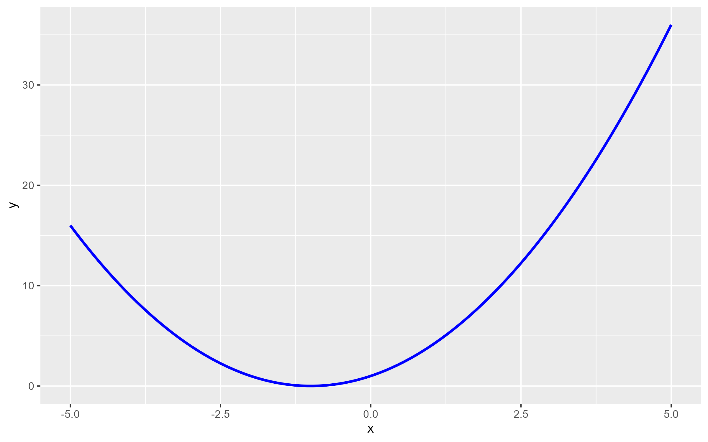

## 直接绘制法

```r
ggplot() +
  geom_function(fun = function(x) x^2 + 2*x + 1, 
                color = "blue") +
  xlim(-5, 5)
```

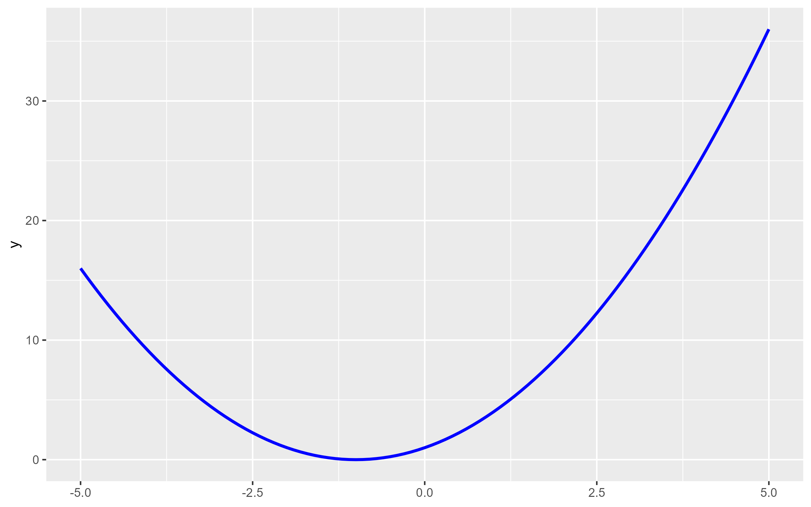

# 二、基础准备

```r
library(ggplot2)
```

# 三、使用 geom_function 绘制基本函数

## 1. 线性函数

$$y = 2x + 1$$

```r
ggplot() +
  geom_function(fun = function(x) 2 * x + 1,  # 线性函数
                color = "blue",              # 线条颜色
                size = 1) +                   # 线条粗细
  xlim(-5, 5)  # x轴范围
```

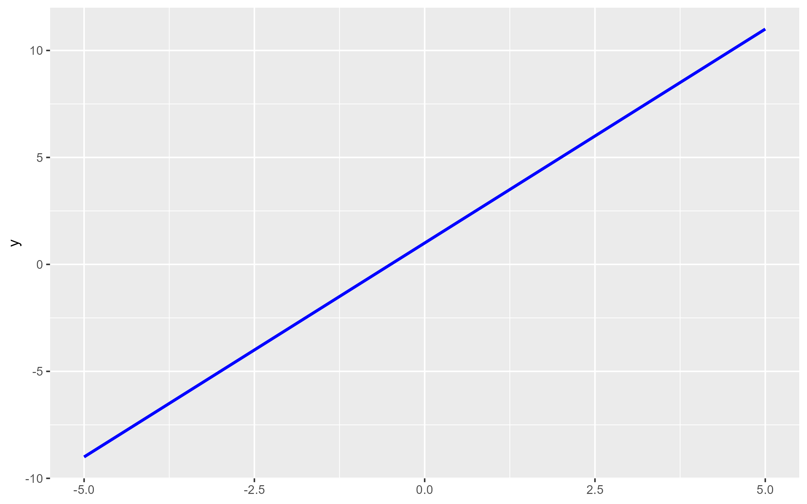

## 2. 二次函数

$$y = 2x^2 - 3x + 1$$

```r
ggplot() +
  geom_function(fun = function(x) 2 * x^2 - 3*x + 1,  # 二次函数
                color = "red",
                size = 1) +
  xlim(-4, 4)
```

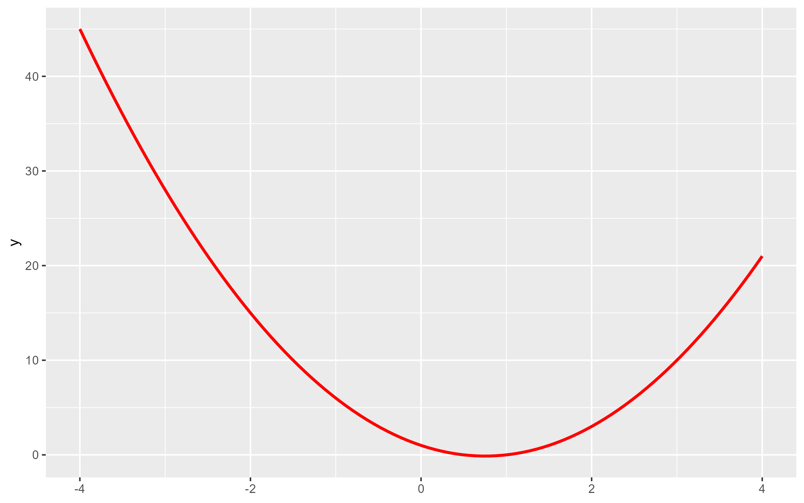

## 3. 指数函数

$$y = 2^x$$

```r
ggplot() +
  geom_function(fun = function(x) 2^x,  # 指数函数
                color = "green",
                size = 1) +
  xlim(-2, 2) +
  ylim(0, 5)  # y轴范围
```

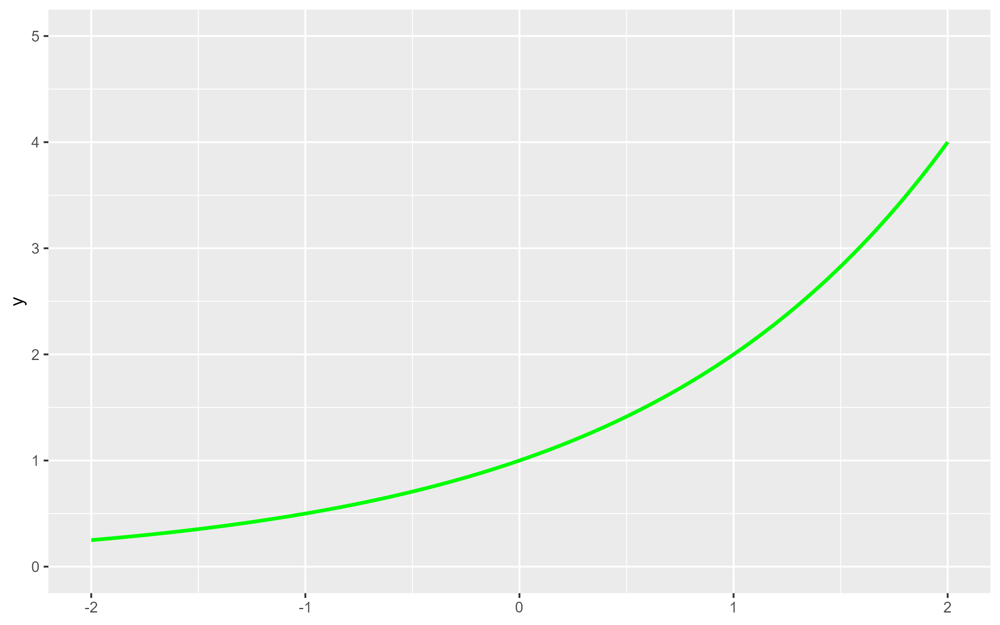

## 4. 对数函数

$$y = \log(x)$$

```r
ggplot() +
  geom_function(fun = function(x) log(x),  # 对数函数
                color = "purple",
                size = 1) +
  xlim(0.1, 5)  # x > 0
```

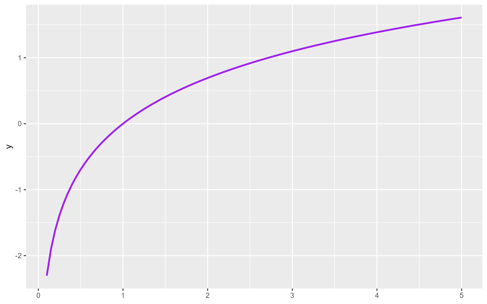

## 5. 三角函数

$$y = \sin(x)$$
$$y = \cos(x)$$

```r
ggplot() +
  geom_function(fun = sin,  # sin函数
                color = "blue",
                size = 1, 
                linetype = "solid") +
  geom_function(fun = cos,  # cos函数
                color = "red",
                size = 1, 
                linetype = "dashed") +
  xlim(-pi, pi) +
  scale_x_continuous(breaks = c(-pi, -pi/2, 0, pi/2, pi),
                     labels = c("-π", "-π/2", "0", "π/2", "π"))
```

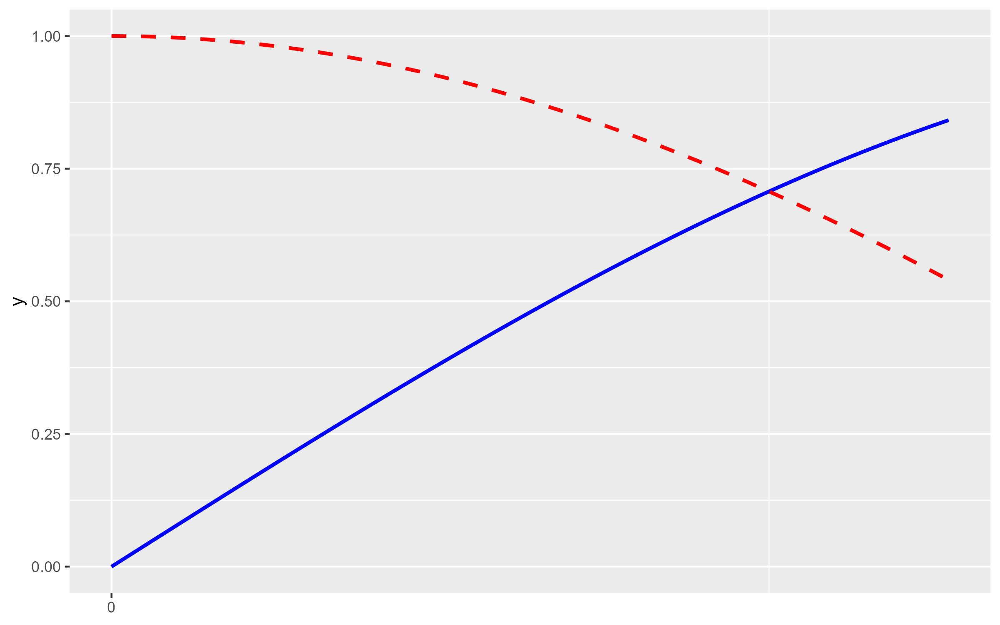

# 四、使用 stat_function 的高级技巧

## 1. 带参数的函数绘制

$$y = x^2$$
$$y = x^3$$

```r
# 定义函数
power_function <- function(x, exponent) {
  return(x^exponent)
}

# 绘制带参数的函数
ggplot() +
  stat_function(fun = power_function, args = list(exponent = 2),
                color = "blue",
                size = 1) +
  stat_function(fun = power_function, args = list(exponent = 3),
                color = "red",
                size = 1) +
  xlim(-2, 2) +
  ylim(-5, 5)
```

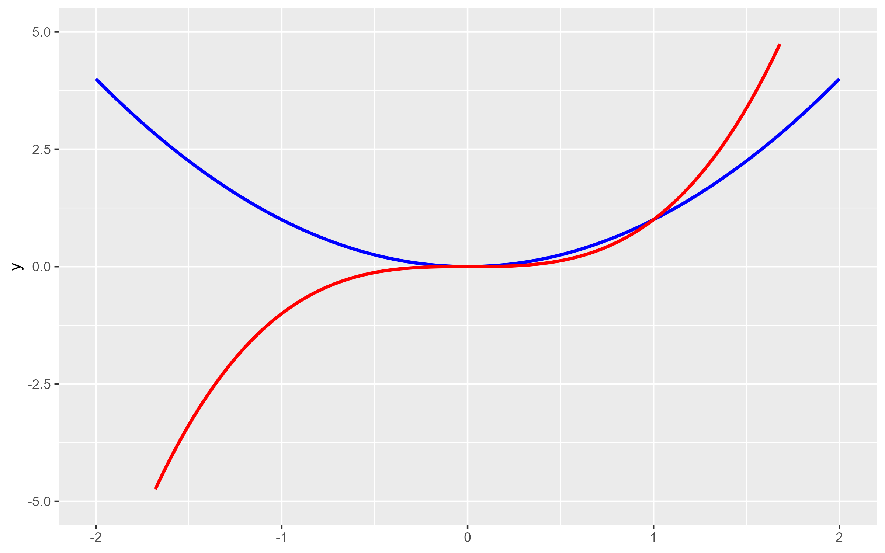

## 2. 概率密度函数

$$f(x) = \frac{1}{\sigma\sqrt{2\pi}} e^{-\frac{1}{2}\left(\frac{x-\mu}{\sigma}\right)^2}$$ （正态分布概率密度函数）

```r
ggplot() +
  stat_function(fun = dnorm,  # 正态分布
                geom = "line",
                color = "#FF5733",
                size = 1.5,
                linetype = "solid") +
  xlim(-3, 3)
```

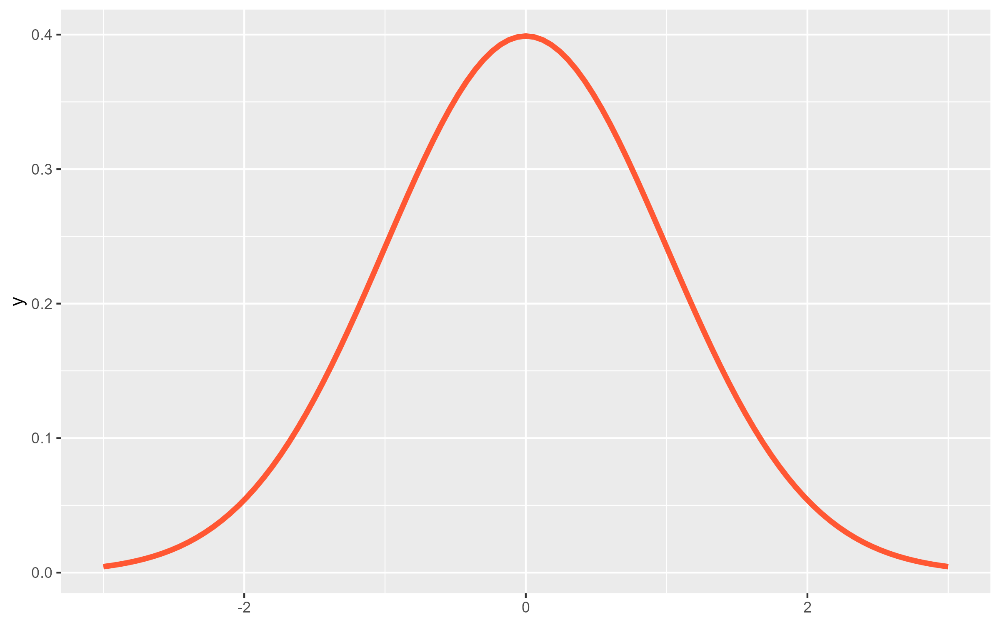

# 五、多函数叠加

$$y = x$$
$$y = x^2$$
$$y = x^3$$

```r
ggplot() +
  geom_function(fun = function(x) x, 
                color = "blue", 
                size = 1) +
  geom_function(fun = function(x) x^2, 
                color = "red", 
                size = 1) +
  geom_function(fun = function(x) x^3, 
                color = "green", 
                size = 1) +
  xlim(-2, 2) +
  ylim(-5, 5)
```

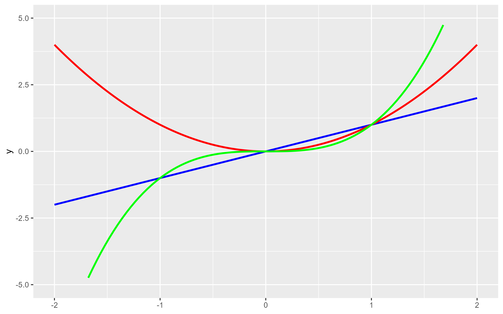

# 六、导数可视化

$$f(x) = x^3 - 2x$$
$$f'(x) = 3x^2 - 2$$

```r
# 定义函数
f <- function(x) x^3 - 2*x  # 原函数
f_prime <- function(x) 3*x^2 - 2  # 导函数

# 绘制原函数和导函数
ggplot() +
  geom_function(fun = f, 
                color = "blue", 
                size = 1.5) +
  geom_function(fun = f_prime, 
                color = "red", 
                size = 1.5) +
  xlim(-3, 3) +
  ylim(-10, 10)
```

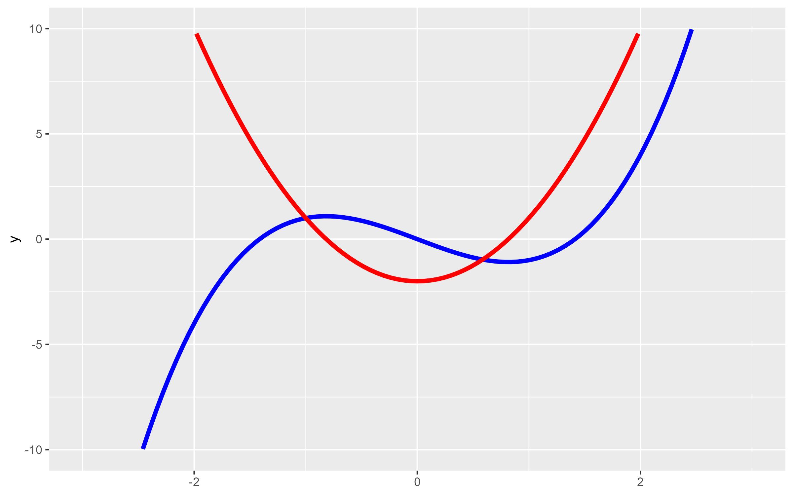

# 七、geom_function 与 stat_function 的选择指南

| 函数 | 适用场景 | 特点 |
| ------ | --------- | ------ |
| **geom_function()** | 直接、简单地绘制函数曲线 | 无需统计转换，语法简洁 |
| **stat_function()** | 需要分组绘制或传递多个复杂参数 | 支持参数传递，更灵活的分组应用 |

# 八、总结

`geom_function()` 和 `stat_function()` 是 ggplot2 中绘制已知函数的高效工具，它们消除了手动生成数据点的繁琐步骤，使函数可视化更加简洁直观。通过灵活运用这些工具，可以高效地展示函数关系和数学概念。
